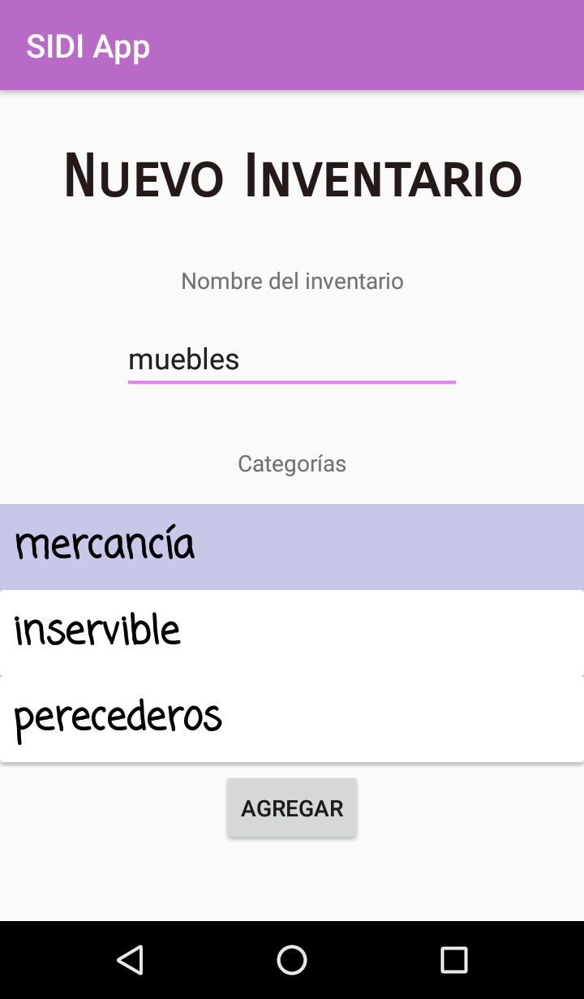

# SIDI App

¡Bienvenidos, hijos míos!

Proyecto SIDI App es una aplicativo para la administración de registros de inventarios con valor agregado en el reconocimiento de objetos mediante la conexión a un servidor de reconocimiento de imágenes.

La ventana principal de la app es la siguiente donde el usuario puede registrar un PIN de seguridad para entrar:

En la parte superior, en la rueda dentada está la sección de ajuste, para cambiar la dirección del servidor de consulta, o cambiar el PIN:

## Aplicación

Una vez dentro de la aplicación, el usuario puede crear inventarios o categorías a inventarios:

En la sección de categorías, el usuario crea nuevas categorías:

Y luego puede crear un inventario:

# Objetos

Una vez creada un inventario, se pueden agregar objetos:

Que serán mostrados entre los demás:
